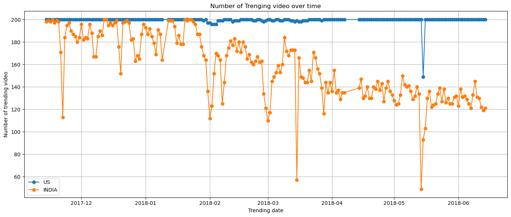
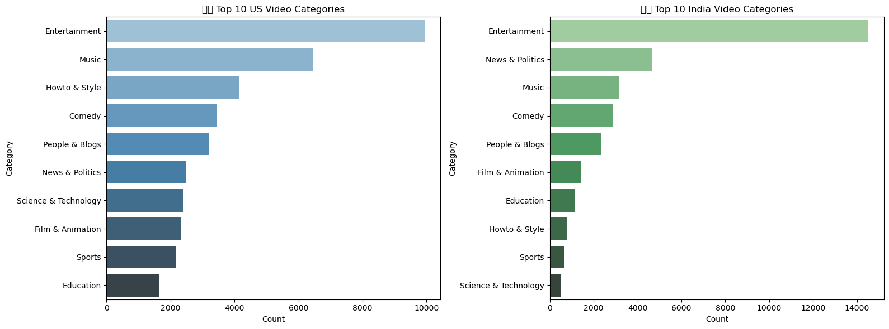

# 📈 YouTube Trending Video Analysis

A data-driven exploration of trending video behavior across India 🇮🇳 and the USA 🇺🇸, uncovering what makes videos trend, how fast they trend, and what factors influence visibility on YouTube.

## 📁 Dataset
- Source: [Kaggle - YouTube Trending Video Dataset](https://www.kaggle.com/datasets/rsrishav/youtube-trending-video-dataset)
- Countries Analyzed: **India**, **USA**
- Format: CSV files (one per country)

## 📌 Objectives

- Analyze how long it takes for a video to trend after publication
- Compare category-wise trending patterns between countries
- Discover factors influencing virality on YouTube
- Visualize insights with Python libraries like **Pandas**, **Matplotlib**, and **Seaborn**

## 🧪 Tools & Technologies

- Python
- Jupyter Notebook
- Pandas & NumPy
- Matplotlib & Seaborn
- Data Cleaning & Preprocessing

## 📊 Key Insights

- **Time to Trend**:  
  - 🇮🇳 Indian videos trend in ~1.4 days on average  
  - 🇺🇸 US videos trend in ~1.8 days

- **Same-Day Trending**:  
  - Many videos trend the **same day** they are published.

- **Category Impact**:  
  - Music and Entertainment videos trend fastest.  
  - Informational or News content lags behind.

- **Virality Factors**:  
  - High engagement (likes/comments) matters more than just views.

## 📌 Conclusion

Trending is not just about views — it's about **timing, category, and audience engagement**. This project reveals cross-country differences and helps creators & analysts understand what drives visibility on YouTube.

## 🖼️ Sample Visualizations

## ✨ Author

**Aditya VK**  
📍 Mumbai, India  
🔗 [Portfolio Website](https://portfolio-gmkboc9wo-aditya-vishwakarmas-projects-ae18906c.vercel.app/)  
💼 [LinkedIn](https://linkedin.com/in/aditya-vk-professional)
